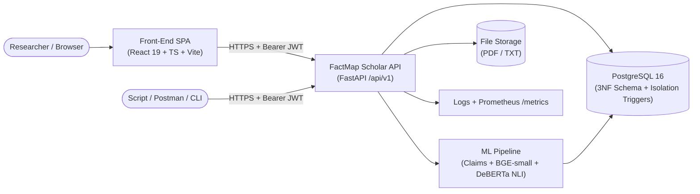
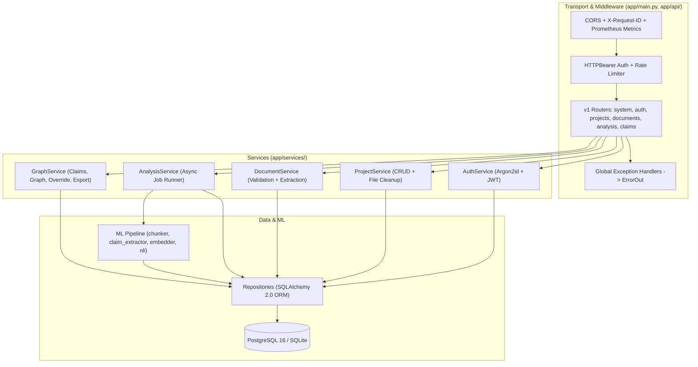
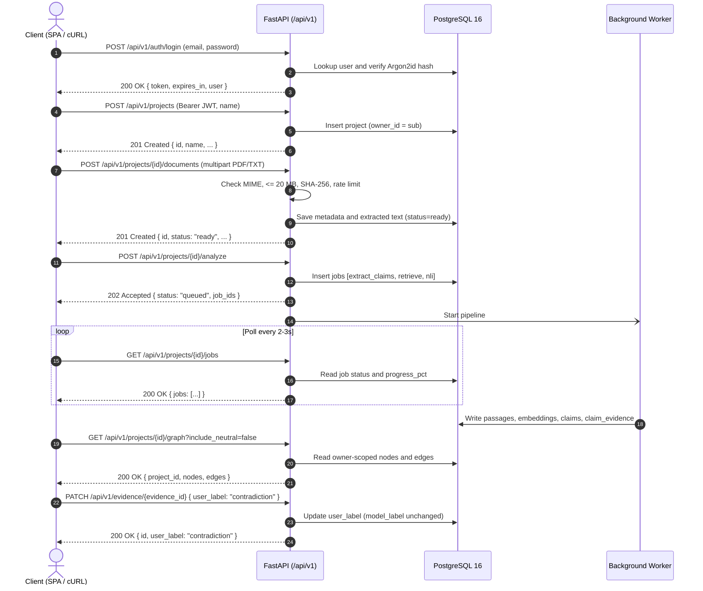

# API Architecture and Request Flows

## 1. System context

```mermaid
flowchart LR
  Researcher(["Researcher / Browser"])
  APIUser(["Script / Postman / CLI"])
  FE["Front-End SPA\n(React 19 + TS + Vite)"]
  API["FactMap Scholar API\n(FastAPI /api/v1)"]
  ML["ML Pipeline\n(Claims + BGE-small + DeBERTa NLI)"]
  DB[("PostgreSQL 16\n(3NF Schema + Isolation Triggers)")]
  FS[("File Storage\n(PDF / TXT)")]
  Obs["Logs + Prometheus /metrics"]

  Researcher --> FE
  FE -- "HTTPS + Bearer JWT" --> API
  APIUser -- "HTTPS + Bearer JWT" --> API
  API --> DB
  API --> FS
  API --> ML
  ML --> DB
  API --> Obs
```

## 2. Backend layers (`backend/app/`)

```mermaid
flowchart TB
  subgraph Transport["Transport & Middleware (app/main.py, app/api/)"]
    MW["CORS + X-Request-ID + Prometheus Metrics"]
    EH["Global Exception Handlers -> ErrorOut"]
    Deps["HTTPBearer Auth + Rate Limiter"]
    Routers["v1 Routers: system, auth, projects, documents, analysis, claims"]
  end

  subgraph Services["Services (app/services/)"]
    AuthS["AuthService (Argon2id + JWT)"]
    ProjS["ProjectService (CRUD + File Cleanup)"]
    DocS["DocumentService (Validation + Extraction)"]
    AnaS["AnalysisService (Async Job Runner)"]
    GraphS["GraphService (Claims, Graph, Override, Export)"]
  end

  subgraph Data["Data & ML"]
    Repos["Repositories (SQLAlchemy 2.0 ORM)"]
    MLPipe["ML Pipeline (chunker, claim_extractor, embedder, nli)"]
    PG[("PostgreSQL 16 / SQLite")]
  end

  MW --> Deps --> Routers
  Routers --> EH
  Routers --> AuthS & ProjS & DocS & AnaS & GraphS
  AuthS & ProjS & DocS & AnaS & GraphS --> Repos
  AnaS --> MLPipe
  MLPipe --> Repos
  Repos --> PG
```

## 3. Request sequence

```mermaid
sequenceDiagram
  autonumber
  actor Client as Client (SPA / cURL)
  participant API as FastAPI (/api/v1)
  participant DB as PostgreSQL 16
  participant Worker as Background Worker

  Client->>API: POST /api/v1/auth/login (email, password)
  API->>DB: Lookup user and verify Argon2id hash
  API-->>Client: 200 OK { token, expires_in, user }

  Client->>API: POST /api/v1/projects (Bearer JWT, name)
  API->>DB: Insert project (owner_id = sub)
  API-->>Client: 201 Created { id, name, ... }

  Client->>API: POST /api/v1/projects/{id}/documents (multipart PDF/TXT)
  API->>API: Check MIME, <= 20 MB, SHA-256, rate limit
  API->>DB: Save metadata and extracted text (status=ready)
  API-->>Client: 201 Created { id, status: "ready", ... }

  Client->>API: POST /api/v1/projects/{id}/analyze
  API->>DB: Insert jobs [extract_claims, retrieve, nli]
  API-->>Client: 202 Accepted { status: "queued", job_ids }
  API-)Worker: Start pipeline

  loop Poll every 2-3s
    Client->>API: GET /api/v1/projects/{id}/jobs
    API->>DB: Read job status and progress_pct
    API-->>Client: 200 OK { jobs: [...] }
  end

  Worker->>DB: Write passages, embeddings, claims, claim_evidence

  Client->>API: GET /api/v1/projects/{id}/graph?include_neutral=false
  API->>DB: Read owner-scoped nodes and edges
  API-->>Client: 200 OK { project_id, nodes, edges }

  Client->>API: PATCH /api/v1/evidence/{evidence_id} { user_label: "contradiction" }
  API->>DB: Update user_label (model_label unchanged)
  API-->>Client: 200 OK { id, user_label: "contradiction" }
```
